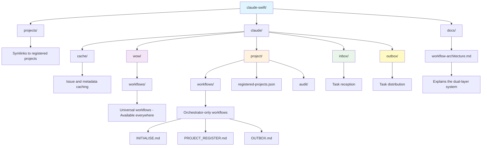

# Claude-Swift Orchestrator

*Multi-project orchestration framework with AI-powered task coordination*

## What is Claude-Swift?

Claude-swift is a top-level orchestrator that manages and coordinates work across multiple registered projects. It provides a unified control point for cross-project task distribution, workflow synchronization, and collaborative AI assistance.

### **Core Capabilities:**
- **Multi-Project Orchestration** - Register and manage multiple projects from a single control point
- **Cross-Project Task Routing** - Inbox/outbox pattern for seamless task distribution
- **Unified Workflow Management** - All projects share identical operational workflows
- **Interactive AI Collaboration** - Work with Claude across projects while maintaining context

### **Architecture:**
- **Orchestrator** (this repository) - Central coordination and task routing
- **Registered Projects** - Individual projects with their own interactive sessions
- **Task Communication** - Asynchronous task exchange via inbox/outbox pattern
- **Workflow Distribution** - Synchronized operational patterns across all projects

## Getting Started

### 1. Initialize Orchestrator
```bash
# Clone the orchestrator
git clone https://github.com/sesameh/claude-swift.git
cd claude-swift

# Initialize workspace
initialise sesame
```

### 2. Register Projects
```bash
# Register a project for orchestration
register jules-tenbos/splectrum sesame
```

### 3. Core Operations
```bash
# Start a work session
start sesame

# Get task recommendations
next sesame

# Route tasks between projects
outbox sesame    # Collect and distribute tasks
inbox sesame     # Process received tasks

# Create a task for another project
task splectrum sesame

# Create a task for current project
task . sesame
```

## Key Concepts

### Orchestrator vs Projects
- **Orchestrator**: Central hub for coordination, task routing, and workflow management
- **Projects**: Individual repositories where actual work happens
- **Sessions**: Interactive work happens in project terminals, coordination happens in orchestrator

### Task Communication
- **Outbox**: Tasks created in projects are collected by orchestrator
- **Inbox**: Orchestrator distributes tasks to target project inboxes  
- **Processing**: Tasks convert to GitHub issues for standard workflow integration

### Workflow Synchronization
- All projects receive identical `claude/wow/` workflows
- Orchestrator maintains master workflow definitions
- Updates propagate to all registered projects

## Documentation

### Understanding Claude-Swift
- **[Orchestrator Overview](docs/orchestrator/overview.md)** - Architecture and technical concepts
- **[Workflow Architecture](docs/workflow-architecture.md)** - Universal vs orchestrator-specific workflows
- **[Interactive Mode](docs/orchestrator/modes/interactive.md)** - Current orchestration mode
- **[Collaborative AI](docs/collaboration/overview.md)** - Philosophy of working with Claude

### Getting Started
- **[Quick Start Guide](docs/getting-started/README.md)** - Get running in minutes
- **[Registered Project Guide](docs/registered-project-guide.md)** - Guide for registered projects
- **[Collaboration Patterns](docs/collaboration/patterns.md)** - How to work effectively with Claude
- **[Sesame Triggers](docs/reference/sesame-triggers.md)** - Complete command reference

### Learning from Experience
- **[Lessons Learned](docs/collaboration/lessons-learned.md)** - Real-world insights
- **[Creative AI Techniques](docs/collaboration/creative-ai.md)** - Advanced collaboration

## Workflow Architecture

Claude-Swift uses a **dual-layer workflow architecture**:

1. **Universal Workflows** (`claude/wow/workflows/`) - Available in ALL repositories
2. **Orchestrator-Only Workflows** (`claude/project/workflows/`) - ONLY in claude-swift

See [Workflow Architecture](docs/workflow-architecture.md) for detailed explanation.

## Sesame Triggers

### 🌍 Universal Workflows (Available Everywhere)
These work in both the orchestrator AND all registered projects:

**Session Management**
- `start sesame` - Begin work session
- `finish sesame` - End session with automated cleanup

**Task Management**
- `task [repo] sesame` - Create task for specific project
- `task . sesame` - Create task for current project
- `next sesame` - Get prioritized work recommendations
- `inbox sesame` - Process received tasks into issues

**Development Operations**
- `commit sesame` - Intelligent commit with issue tracking
- `issue sesame` - Create GitHub issue with metadata

**Release Management**
- `release sesame` - Full version release
- `patch sesame` - Patch release
- `version sesame` - Version planning
- `transition sesame` - Version transition automation

### 🎯 Orchestrator-Only Workflows
These ONLY work in the claude-swift repository:

**Multi-Project Management**
- `initialise sesame` - One-time orchestrator workspace setup
- `register [org/repo] sesame` - Register a project for orchestration
- `outbox sesame` - Collect and distribute tasks across projects

## Project Structure



## Requirements

- Claude Code CLI
- GitHub CLI (`gh`) authenticated
- Git configured
- Write access to registered project repositories

## Support

For questions and issues:
1. Check documentation in `docs/`
2. Review workflows in `claude/wow/workflows/`
3. Check recent audit logs in `claude/project/audit/current/current.log`
4. Create an issue in this repository

---

**Note**: This is an orchestrator, not a deployed template. Projects are registered and managed, not cloned or deployed.