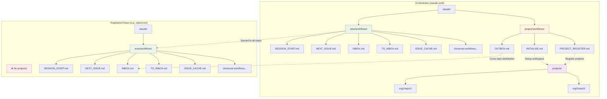

[← Back to Claude-Swift](../README.md)

# Workflow Architecture

This document explains the distinction between universal WoW (Ways of Working) workflows and project-specific workflows in the Claude-Swift framework.

## Overview

Claude-Swift uses a **three-layer workflow architecture**:

1. **Universal WoW Workflows** - Available in ALL repositories using the framework
2. **Project-Specific Workflows** - Only available in the orchestrator repository (claude-swift)
3. **Task-Delivered Workflows** - Specialized workflows that travel with tasks/issues

## Workflow Categories

### Universal WoW Workflows (`claude/wow/workflows/`)

These workflows are part of the core framework and work identically in:
- The orchestrator repository (claude-swift)
- All registered/orchestrated repositories (e.g., splectrum, spl1, InfoMetis)

**Universal Workflow List:**
- `SESSION_START` / `SESSION_END` - Session management
- `NEXT_ISSUE` - Issue prioritization and selection
- `COMMIT` - Intelligent commit with issue closure
- `CREATE_ISSUE` / `ISSUE_CACHE` - Issue management and local caching
- `INBOX` / `OUTBOX` / `TASK_CREATE` - Task processing and creation
- `RELEASE_PROCESS` / `VERSION_TRANSITION` - Release management
- `NEW_VERSION_PLANNING` - Version planning
- `AUDIT_LOGGING` - Audit trail management
- `MANDATORY_RULES_REFRESH` - Rule compliance
- `GIT_WORKFLOW` - Git operations
- `OPERATIONAL_RULES` - Development standards
- `DOCUMENTATION_WORKFLOW` - Documentation management

### Project-Specific Workflows (`claude/project/workflows/`)

These workflows are **ONLY** available in the orchestrator repository (claude-swift) and enable multi-project management:

**Orchestrator-Only Workflows:**
- `INITIALISE` - One-time workspace setup for multi-project management
- `PROJECT_REGISTER` - Register sub-projects with the orchestrator
- `OUTBOX` - Distribute tasks across registered projects

### Task-Delivered Workflows (Dynamic)

These workflows are **embedded within tasks** and delivered through the inbox/outbox pipeline. They enable specialized expertise to flow with work requests across project boundaries.

**Task-Delivered Workflow Types:**

#### Project Type Templates
Pre-configured workflow suites for specialized project domains:
- **API Wrapper Projects** - Development workflows for third-party integrations
- **Planning Projects** - Strategic planning and coordination methodologies  
- **Security Projects** - Security-specific assessment and implementation workflows
- **Performance Projects** - Optimization and benchmarking procedures
- **Documentation Projects** - Technical writing and knowledge management workflows

#### Encapsulated Workflows
Self-contained specialized procedures embedded directly in tasks/issues:
- Cross-project standards enforcement
- Domain-specific implementation guidelines
- Quality assurance procedures
- Reporting and assessment templates
- Integration and deployment protocols

## Key Differences

### Universal Workflows
- Work in **any** repository with the WoW framework
- Handle single-repository operations
- No dependency on workspace structure
- Can be used by both orchestrator and orchestrated repos

### Project-Specific Workflows  
- Work **only** in the orchestrator repository
- Require `projects/` directory structure
- Enable cross-repository operations
- Manage the relationship between multiple projects

### Task-Delivered Workflows
- Travel **with tasks** through inbox/outbox pipeline
- Provide specialized domain expertise
- Enable cross-project standards enforcement  
- Create temporary behavioral overlays in receiving projects

## Architecture Diagram



## Workflow Availability

| Workflow | Orchestrator | Registered Repos | Trigger | Description |
|----------|--------------|------------------|---------|-------------|
| SESSION_START | ✅ | ✅ | `start sesame` | Session initialization |
| NEXT_ISSUE | ✅ | ✅ | `next sesame` | Issue prioritization |
| INBOX | ✅ | ✅ | `inbox sesame` | Process tasks to issues (with milestone assignment) |
| TO_INBOX | ✅ | ✅ | `to-inbox sesame` | Process self-targeted tasks |
| TASK_CREATE | ✅ | ✅ | `task [target] sesame` | Create cross-repository tasks |
| ISSUE_CACHE | ✅ | ✅ | `issue sesame` | Local issue caching |
| INITIALISE | ✅ | ❌ | `initialise sesame` | Setup orchestrator workspace |
| PROJECT_REGISTER | ✅ | ❌ | `register [repo] sesame` | Register projects for orchestration |
| OUTBOX (Cross-repo) | ✅ | ❌ | `outbox sesame` | Distribute tasks to all registered projects |

## Usage Examples

### In Orchestrator (claude-swift)
```bash
# Universal workflows work
start sesame                    # Session initialization
next sesame                     # Find next issue to work on
to-inbox sesame                 # Process self-targeted tasks
inbox sesame                    # Convert tasks to GitHub issues
issue sesame                    # Sync issue cache

# Project-specific workflows also work
initialise sesame               # Setup workspace (one-time)
register org/repo sesame        # Register new projects
outbox sesame                   # Distribute tasks to all projects
```

### In Registered Repo (e.g., splectrum)
```bash
# Universal workflows work
start sesame                    # Session initialization
next sesame                     # Find next issue to work on
to-inbox sesame                 # Process self-targeted tasks
inbox sesame                    # Convert tasks to GitHub issues
issue sesame                    # Sync issue cache

# Project-specific workflows NOT available
initialise sesame               # ❌ Error: workflow not found
register org/repo sesame        # ❌ Error: workflow not found
outbox sesame                   # ❌ Error: workflow not found
```

## Implementation Notes

1. **CLAUDE.md Behavior**: When a sesame trigger is not found in the universal list, Claude checks `claude/project/KEYWORD_REGISTRY.md` for project-specific workflows.

2. **Workflow Discovery**: The MANDATORY rule in CLAUDE.md ensures project-specific workflows are found when working in the orchestrator.

3. **Task Flow**: 
   - Tasks created with `TASK_CREATE` (universal)
   - Distributed by `OUTBOX` (orchestrator-only)
   - Received by `INBOX` (universal)

4. **Cache Management**: Both `CREATE_ISSUE` and `INBOX` workflows update the issue cache for `NEXT_ISSUE` performance.

## Cross-Project Workflow Encapsulation

Task-delivered workflows enable **workflow federation** - specialized projects can extend their expertise and standards across the ecosystem without requiring permanent adoption.

### How It Works

1. **Specialized Project** creates task with embedded workflow
2. **Task travels** through outbox → inbox pipeline  
3. **Receiving project** processes task into issue with specialized template
4. **Temporary behavioral overlay** - receiving project adopts specialized workflow for this deliverable
5. **Project maintains identity** while following requestor's standards

### Example Scenarios

#### Planning → Implementation
```
Planning Project creates task:
- Work: "Create API documentation for payment gateway"
- Embedded WoW: Planning project's documentation standards
- Standards: Specific format, review process, quality gates
- Template: Documentation issue with planning project's workflow

Implementation Project receives:
- Temporarily adopts planning project's documentation workflow
- Maintains own coding practices
- Delivers to planning project's standards
```

#### Coordination → Multiple Projects  
```
Coordination Project distributes task:
- Work: "Provide architecture assessment for Q4 planning"
- Embedded WoW: Assessment template and reporting format
- Standards: Specific deliverable structure, timeline requirements
- Template: Assessment issue with coordinator's methodology

Each Project receives:
- Same specialized assessment workflow
- Consistent deliverable format across all projects
- Coordinator gets standardized inputs for strategic decisions
```

### Benefits

#### For Requesting Projects
- **Standards Enforcement**: Ensure deliverables meet specific requirements
- **Quality Consistency**: Standardized approaches across diverse teams
- **Expertise Distribution**: Share specialized methodologies organization-wide
- **Integration Efficiency**: Receive consistently formatted deliverables

#### For Receiving Projects
- **Domain Learning**: Exposure to specialized practices
- **Temporary Expertise**: Access to workflows beyond project scope  
- **Autonomy Preservation**: Core project identity remains unchanged
- **Quality Enhancement**: Benefit from specialized standards

### Implementation Patterns

#### Template-Based Encapsulation
- Issue templates carry embedded workflows
- GitHub issue forms with specialized fields
- Automated workflow activation based on issue type
- Project-specific quality gates and acceptance criteria

#### Metadata-Driven Workflows
- Task metadata defines required workflow overlay
- Dynamic workflow selection based on requesting project
- Inheritance of requestor's standards and processes
- Automatic workflow cleanup after completion

## Summary

The three-layer architecture enables:
- **Portability**: Universal workflows work identically everywhere
- **Specialization**: Orchestrator has additional capabilities  
- **Federation**: Specialized expertise flows with work requests
- **Separation**: Clear boundaries between workflow layers
- **Consistency**: Same operational patterns across all projects
- **Flexibility**: Dynamic workflow adaptation based on work requirements

---

[← Back to Claude-Swift](../README.md) | [Registered Project Guide →](registered-project-guide.md)